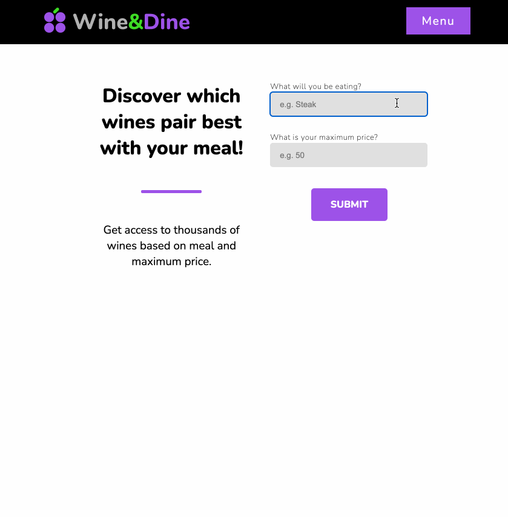

# Wine & Dine

A dynamic HTML, CSS and JavaScript web application for wine enthusiasts and cooks who want to find wine pairings based on food and maximum price!

## Project Rationale

Hello! My name is Simon and I created this AJAX project to demonstrate my knowledge of HTML, CSS and JavaScript! In addition to using these languages, I am requesting information from an API to use for this application. "Wine&Dine" is a wine pairing app which allows you to input a type of food and set a maximum price to discover which wine pairs best with those inputs! Enjoy!

## Live Demo

- Try the application live at [https://skim-329.github.io/wine-and-dine/]

## Technologies Used

- HTML5
- CSS3
- JavaScript
- AJAX
- JSON
- Figma

## Features

- User can search for a wine recommendation based on food and maximum price parameters.
- User can read about why the recommended wine pairs well with their food selection.
- User can view the label for the recommended wine.
- User can add a recommended wine to their favorites list.
- User can view a collection of their favorite wines.
- User can find out more about the Wine&Dine application.

## Preview



## Stretch Features

- User can purchase recommended wine with an online retailer link.

## Getting Started

1. Clone the repository.
   ```
      git clone git@github.com:Skim-329/wine-and-dine.git
      cd wine-and-dine
   ```
2. Open the index.html located in the root folder and view the application by opening in a default browser.
